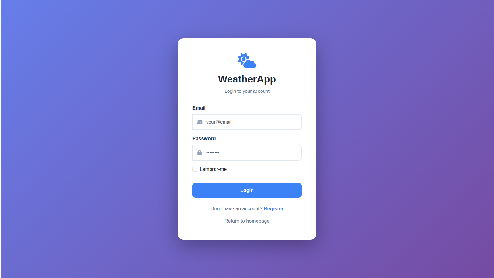
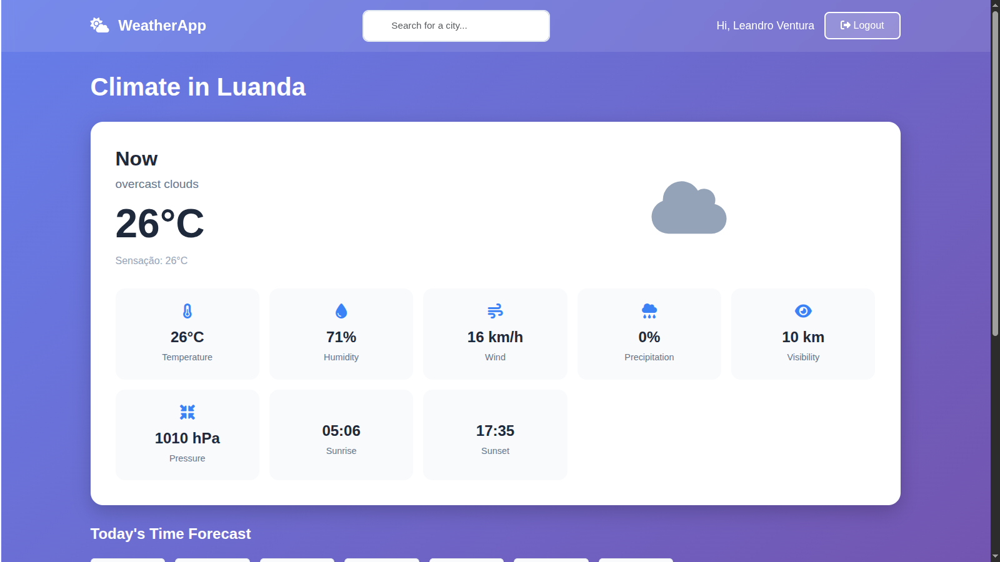
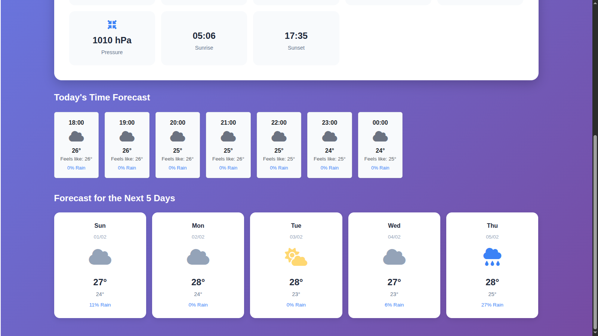

# WeatherApp

<p align="center">
  
  
  
  
  
  
</p>

<p align="center">
  <strong>Full-stack weather platform built with Laravel</strong><br>
  Real-time weather, forecasts, alerts and city search with caching and authentication.
</p>

---

## Overview

**WeatherApp** is a full-stack web application built with **Laravel**, **Bootstrap**, **JavaScript**, **jQuery**, and **MySQL**.  
It integrates with the **OpenWeatherMap API** to deliver real-time weather data and forecasts for cities worldwide.

Users can access current conditions, hourly and daily forecasts, and active weather alerts through a clean, responsive dashboard.

---

## Key Features

- Real-time weather data (temperature, humidity, wind, visibility, sunrise/sunset)
- Hourly forecast with scrollable cards
- 5-day daily forecast with min/max temperatures and precipitation
- Weather alerts with detailed descriptions
- City search with autocomplete (backend-powered)
- User authentication (login & registration)
- Responsive UI (Bootstrap 5)
- MySQL caching layer to reduce API usage
- Stored historical weather data

---

## Tech Stack

### Backend
- Laravel
- PHP 8+
- MySQL

### Frontend
- Bootstrap 5
- JavaScript
- jQuery
- Blade Templates

### External Services
- OpenWeatherMap API

---

## Installation

### 1. Clone the repository

```bash
git clone https://github.com/leandroleonard/weather-wise.git
cd weather-wise
```

### 2. Install dependencies

```bash
composer install
npm install
npm run dev
```

### 3. Environment setup

```bash
cp .env.example .env
php artisan key:generate
```

Configure in `.env`:

* Database credentials
* OpenWeatherMap API Key

```env
OPENWEATHER_API_KEY=your_api_key
```

### 4. Database

Import the SQL file:

```
database/weather_wise.sql
```

### 5. Run the application

```bash
php artisan serve
```

Access:

```
http://localhost:8000
```

---

## Usage

* View featured cities on the home page
* Search for any city using the dashboard search bar
* Register and login for personalized access
* View hourly, daily forecasts and weather alerts

---

## Project Structure

```
app/
 ├── Models/              # Eloquent models: City, Weather, WeatherDaily, WeatherHourly, WeatherAlert, User
 ├── Http/Controllers/    # Controllers handling web and API requests
 ├── Libs/                # Base API request classes and helper libraries
 ├── Console/Commands/    # Artisan commands (e.g., update main cities)
 
resources/
 ├── views/               # Blade templates for frontend views

public/
 ├── css/                 # Compiled CSS including Bootstrap and custom styles

routes/
 ├── web.php              # Web routes
```

---

## API Integration

* OpenWeatherMap One Call API
* Server-side caching in MySQL
* City autocomplete API endpoint
* Optimized API call frequency

---

## Screenshots







## Video Demo

🔗 

---

